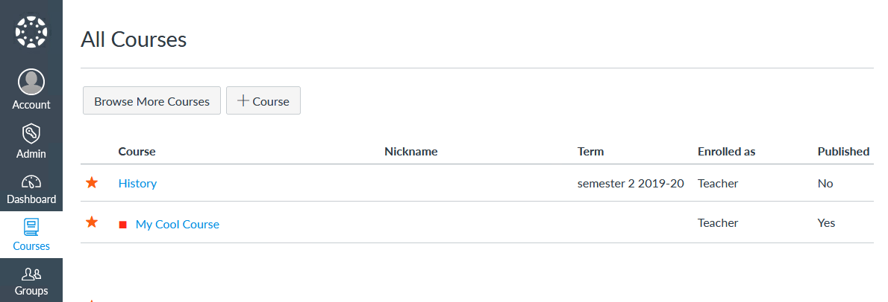
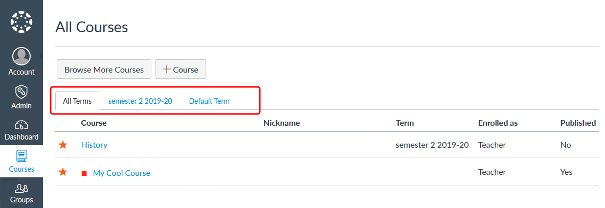

# Canvas LMS All Courses Terms Tabs Plug-in

Plugin for the [Canvas LMS theme app](https://www.npmjs.com/package/@artevelde-uas/canvas-lms-app) that groups the
courses on the 'All Courses' page in tabs per term.

[](https://www.npmjs.com/package/@artevelde-uas/canvas-lms-all-courses-terms-tabs-plugin)
[](https://spdx.org/licenses/ISC)
[](https://www.npmjs.com/package/@artevelde-uas/canvas-lms-all-courses-terms-tabs-plugin)
[](https://github.com/artevelde-uas/canvas-lms-all-courses-terms-tabs-plugin/pulls)

#### Before:


#### After:


## Installation

Using NPM:

    npm install @artevelde-uas/canvas-lms-all-courses-terms-tabs-plugin

Using Yarn:

    yarn add @artevelde-uas/canvas-lms-all-courses-terms-tabs-plugin

## Usage

Just import the plug-in and add it to the Canvas app:

```javascript
import canvas from '@artevelde-uas/canvas-lms-app';
import allCoursesTermsTabsPlugin from '@artevelde-uas/canvas-lms-all-courses-terms-tabs-plugin';

canvas.addPlugin(allCoursesTermsTabsPlugin);

canvas.run();
```
